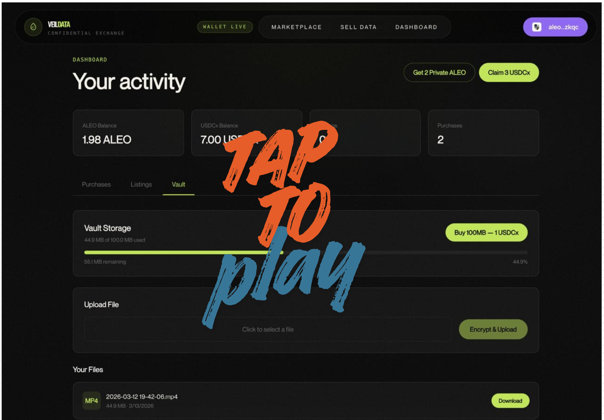
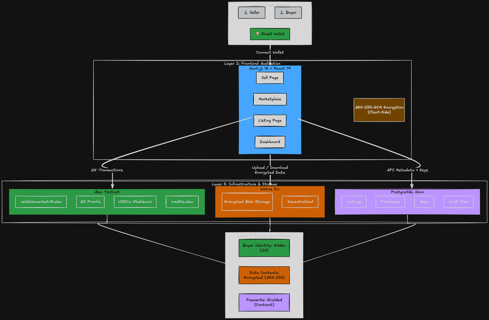
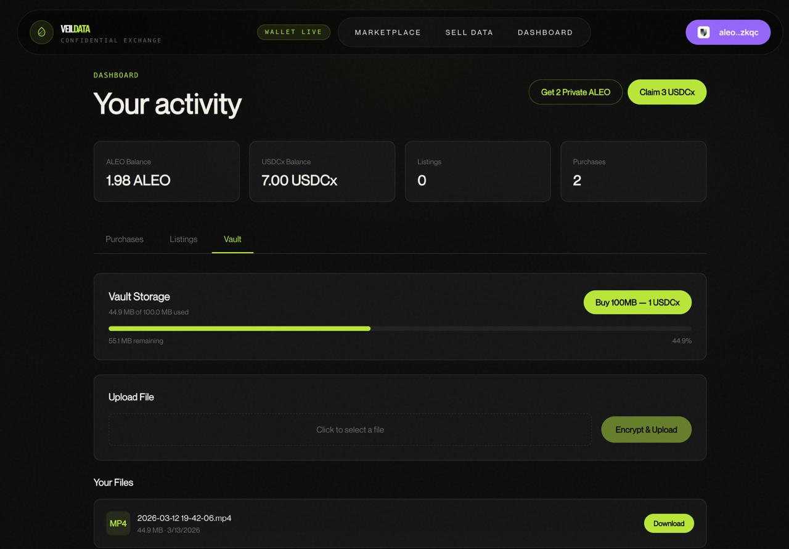

# VeilData — Confidential Data Marketplace

**Live:** [exorbilabs.xyz](https://www.exorbilabs.xyz)

[](https://youtu.be/VUdvEKvZjeY)

VeilData is a privacy-preserving data marketplace built on [Aleo](https://aleo.org). It enables anyone to list, sell, and purchase datasets with **zero-knowledge privacy** for buyers, **AES-256-GCM encryption** for data contents, and **decentralized storage** via [Walrus](https://walrus.xyz) on Sui. The entire purchase flow runs through a custom Aleo smart contract, ensuring buyer identities remain shielded by ZK proofs while payments settle directly to sellers in USDCx stablecoins.

> Built for the **Aleo Privacy Buildathon** (AKINDO, Wave 3)

---

## Why VeilData?

Traditional data marketplaces expose **who buys what** — a significant privacy and competitive risk. VeilData solves this by combining three privacy layers:

| Layer | Technology | What It Protects |
|-------|-----------|-----------------|
| **Buyer Identity** | Aleo ZK Proofs | Who purchased a dataset is hidden on-chain |
| **Data Contents** | AES-256-GCM | Files are encrypted client-side before upload — only buyers with the key can decrypt |
| **Payment Privacy** | On-chain contract execution | Purchase details are shielded inside ZK proof execution |
| **Decentralized Storage** | Walrus (Sui) | Encrypted blobs stored on decentralized infrastructure — no single point of failure |

**The result:** Sellers list data openly. Buyers purchase privately. Nobody except the buyer can see what was purchased or decrypt the data.

---

## How It Works

### Seller Flow
1. **Encrypt** — Data is encrypted with AES-256-GCM in the browser (key never leaves the client)
2. **Upload** — Encrypted blob is stored on Walrus decentralized storage
3. **List on-chain** — `veildatamarketv8.aleo/create_listing` registers metadata (price, schema, category) on Aleo
4. **Platform fee** — 0.2 ALEO paid via `credits.aleo/transfer_public` to the platform pool

### Buyer Flow
1. **Browse** — View listings with schema previews, row counts, and categories
2. **Purchase** — `veildatamarketv8.aleo/purchase` sends USDCx directly to the seller through ZK execution
3. **Auto-delivery** — Decryption key is available immediately after purchase (no manual seller action)
4. **Download & Decrypt** — Fetch encrypted blob from Walrus, decrypt in-browser, download the file

### Privacy Breakdown
| Data Point | Visibility |
|-----------|-----------|
| Dataset title, schema, category | Public (on-chain) |
| Dataset contents | Encrypted (AES-256-GCM) |
| Buyer identity | Hidden (ZK proof) |
| Seller identity | Public (on-chain) |
| Purchase amount | Shielded (inside ZK execution) |
| Row count | Public (on-chain) |

---

## Architecture



---

## Smart Contract — `veildatamarketv8.aleo`

Deployed on Aleo Testnet. The contract handles listing creation, purchasing with ZK privacy, and a USDCx faucet for testers.

### Transitions

| Function | Description |
|----------|-------------|
| `create_listing` | Registers a new dataset on-chain with metadata (price, schema hash, category, row count) |
| `purchase` | Buyer purchases a listing — USDCx sent directly to seller via `transfer_public_as_signer` with ZK privacy |
| `claim_test_usdcx` | One-time faucet: claim 3 USDCx for testing (one per wallet) |

### On-Chain Mappings

| Mapping | Purpose |
|---------|---------|
| `listings` | Listing metadata (category, price, seller, row count, schema hash) |
| `listing_status` | Status tracking (1 = active) |
| `buyer_purchases` | Prevents same buyer from purchasing a listing twice |
| `listing_purchase_count` | Total purchases per listing |
| `seller_sales` | Seller's cumulative sale count |
| `total_listings` | Global listing counter |
| `claimed_faucet` | Tracks which wallets have claimed the USDCx faucet |

### Key Design Decisions

- **No escrow** — USDCx goes directly to the seller on purchase for instant settlement
- **Multi-buyer support** — Listings stay active after purchase; multiple buyers can buy the same dataset
- **`transfer_public_as_signer`** — Solves the cross-program caller issue where `self.caller` becomes the program address in nested calls. Using `self.signer` ensures the original user (buyer) is debited
- **Automatic key delivery** — Buyer gets the decryption key immediately after purchase via the API, no manual seller action needed

### Deploy Transactions

| Version | Transaction ID |
|---------|---------------|
| v8 (current) | `at1ex656a7hrrzpyhexwfjcypcc262c3mwuu78hkh3my7qxgzrgjgrsed4tak` |

---

## Encrypted Vault



Beyond the marketplace, VeilData includes a personal **Encrypted Vault** — a private file locker for any user:

- **Purchase storage** — 1 USDCx = 100MB of vault space
- **Upload files** — Encrypted client-side with AES-256-GCM, stored on Walrus
- **Download & decrypt** — Only the file owner can retrieve and decrypt their files
- **Use case** — Store sensitive documents, backups, or research data with blockchain-grade encryption and decentralized availability

---

## Tech Stack

| Layer | Technology |
|-------|-----------|
| **Frontend** | Next.js 16, React 19, TypeScript 5, Tailwind CSS 4 |
| **Animations** | GSAP 3, Framer Motion 12 |
| **Blockchain** | Aleo (Leo language), Shield Wallet Adapter |
| **Stablecoin** | test_usdcx_stablecoin.aleo (USDCx with 6 decimals) |
| **Storage** | Walrus (Sui) via @3mate/walrus-sponsor-sdk |
| **Database** | PostgreSQL (Neon) via Prisma 7 |
| **Encryption** | AES-256-GCM (Web Crypto API, client-side) |
| **Hosting** | Vercel |
| **Domain** | exorbilabs.xyz (Namecheap) |

---

## Project Structure

```
src/
├── app/
│   ├── page.tsx                    # Landing page
│   ├── marketplace/page.tsx        # Browse listings
│   ├── listing/[id]/page.tsx       # Listing detail + purchase + download
│   ├── sell/page.tsx               # Multi-step listing creation
│   ├── dashboard/page.tsx          # User activity, vault, balances
│   └── api/
│       ├── listings/               # CRUD for listings
│       ├── listings/[id]/key/      # Encryption key access control
│       ├── purchases/              # Purchase records
│       ├── claim-usdcx/            # USDCx faucet
│       └── vault/                  # Vault storage & files
├── components/
│   ├── landing/                    # Hero, Features, HowItWorks, Marquee
│   ├── marketplace/                # ListingCard, MarketplaceGrid
│   └── shared/                     # Navbar, Footer, ClientProviders
└── lib/
    ├── aleo.ts                     # Transaction builders
    ├── chain.ts                    # On-chain mapping readers
    ├── crypto.ts                   # AES-256-GCM encrypt/decrypt
    ├── walrus.ts                   # Walrus upload/download
    ├── db.ts                       # Prisma client singleton
    ├── listings.ts                 # Listing/purchase API client
    └── vault.ts                    # Vault API client
```

---

## Getting Started

### Prerequisites

- Node.js 18+
- [Shield Wallet](https://chrome.google.com/webstore/detail/shield-wallet/) browser extension
- Aleo testnet tokens (for platform fees)

### Setup

```bash
git clone https://github.com/Nuel-osas/veildata.git
cd veildata-app
npm install
```

Create `.env.local`:

```env
# Aleo
NEXT_PUBLIC_ALEO_PROGRAM_ID=veildatamarketv8.aleo
NEXT_PUBLIC_ALEO_NETWORK=testnet
NEXT_PUBLIC_ALEO_API=https://api.explorer.provable.com/v1

# Walrus
NEXT_PUBLIC_WALRUS_API_KEY=<your-walrus-api-key>
NEXT_PUBLIC_WALRUS_SPONSOR_URL=https://walrus-sponsor.krill.tube
NEXT_PUBLIC_WALRUS_CREATOR_ADDRESS=<your-walrus-creator-address>

# Database (Neon PostgreSQL)
DATABASE_URL=<your-database-url>
DIRECT_URL=<your-direct-url>
```

```bash
npx prisma generate
npx prisma db push
npm run dev
```

Open [http://localhost:3000](http://localhost:3000).

### Testing the Flow

1. **Connect** Shield Wallet on testnet
2. **Claim USDCx** — Go to Dashboard, click "Claim 3 USDCx" (one-time faucet)
3. **List data** — Go to Sell Data, fill details, upload a CSV, pay 0.2 ALEO platform fee
4. **Purchase** — Browse Marketplace, click a listing, purchase with USDCx
5. **Download** — After purchase, click "Download Data" to decrypt and download

---

## Security Model

- **Client-side encryption** — Files are encrypted in the browser before upload. The server and Walrus only ever see ciphertext.
- **Key access control** — Decryption keys are stored server-side and only released to the seller (always) or an authorized buyer (after purchase).
- **ZK privacy** — Aleo's zero-knowledge proofs hide buyer identity and purchase details on-chain.
- **No private key exposure** — All wallet interactions go through Shield Wallet. The app never handles private keys.
- **Decentralized storage** — Walrus ensures encrypted data isn't dependent on any single server.

---

## Addresses

| Entity | Address |
|--------|---------|
| Program (v8) | `aleo17kc2tkll7plruvg4kvd9p93udknx977dldrw7me02znh5naf0u8sf5zd88` |
| Platform Pool | `aleo12m9nrm9fqvvfj6sm7mqw5quwklqldfedu8kv43rnp33v09aqlvgq5hck26` |
| Deployer | `aleo17ws85rl69jen0pj0mjum9hphwk5uxtc7wtad9asf89q8ltgeusxq5h6czn` |

---

## License

MIT

---

**Built by [Exorbi Labs](https://www.exorbilabs.xyz) for the Aleo Privacy Buildathon (AKINDO Wave 3)**
